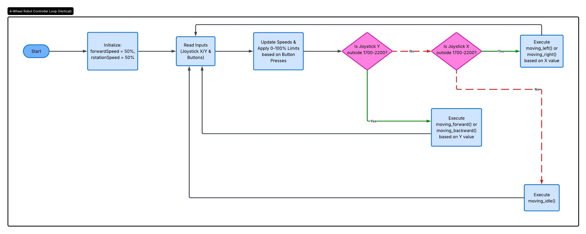

# aupp-robotic

## Flowchart 

### What is purpose of using two different speed?

The purpose of using two different speed ( linear speed and rotation speed) is to let user 
control the robot more precisely and safely because if the robot only one speed setting, it 
can make the robot difficult to control. For example, when the robot is traveling down a long, 
straight path, it can use a higher forward speed to reach its destination more quickly. 
However, when it approaches a corner or needs to change direction, the turning speed can be reduced 
to make the turn smoother and more accurate. Slowing down while turning helps prevent the robot from 
overshooting the desired direction, losing stability, or colliding with nearby obstacles. Therefore, 
byusing different speed, the user can adjust each movement independently based on the situation.

### How does the flowchart help in designing the program?

The flowchart helps us visualize the flow of the entire system from end to finish which provide the opportunity for us to identify what we should build first, how to go, and make decision early on to avoid conflicted, bugs, and put restraint; like deciding to prioritize the y-axis if we move the joystick in the gap, and speed restraint to avoid burning the physical components. 

### Video Demo
Video link: https://aupp-my.sharepoint.com/:v:/g/personal/2023460mao_aupp_edu_kh/IQAtTKGM2mvITL49AuMpAN-0ATM8b2nqXiOhC8J5EHRNTDs?nav=eyJyZWZlcnJhbEluZm8iOnsicmVmZXJyYWxBcHAiOiJPbmVEcml2ZUZvckJ1c2luZXNzIiwicmVmZXJyYWxBcHBQbGF0Zm9ybSI6IldlYiIsInJlZmVycmFsTW9kZSI6InZpZXciLCJyZWZlcnJhbFZpZXciOiJNeUZpbGVzTGlua0NvcHkifX0&e=ZCSCaW
